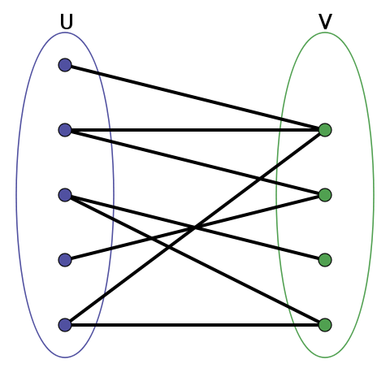
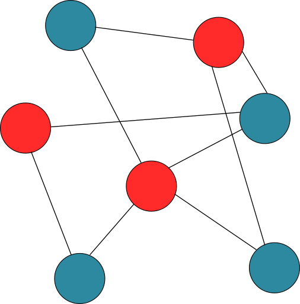
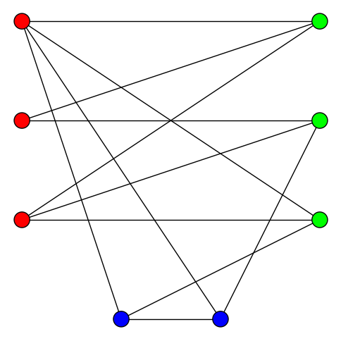

## Определение двудольного графа

Двудольный граф - граф, вершины которого можно разбить на два множества
так, что каждое ребро соединяет вершины из разных множеств.

Часто в контексте двудольных графов используется понятие *цвета*
вершины. Разбитие графа на две доли называется *покраской* его вершин
в два различных цвета. Каждое ребро должно соединять вершины различного цвета.

Существует ещё один признак двудольности графа: граф является двудольным тогда
и только тогда, когда в нём отсутствуют циклы нечётной длины.

## Проверка графа на двудольность

Для проверки графа на двудольность и разбития его на доли чаще всего
используется DFS.

Начинаем покраску с произвольной вершины, которую красим в произвольный цвет.
При прохождении по каждому ребру красим следующую вершину в противоположный цвет.
Если при переборе соседних вершин мы нашли вершину, уже покрашенную в тот же
цвет, что и текущая, то в графе существует нечётный цикл, а значит, он не
является двудольным.

## Реализация


#include <bits/stdc++.h>

using namespace std;

vector<int> graph[100000];
char color[100000];     //Цвет будем представлять типом char
                        //0 - вершина ещё не покрашена; 1, 2 - различные цвета.

inline char invert(int c) {
    return c == 1 ? 2 : 1;
}

void dfs(int v, char c) {   //c - цвет текущей вершины
    color[v] = c;

    for (int u: graph[v]) {
        if (color[u] == 0) {    //непосещённая вершина
            dfs(u, invert(c));
        } else if (color[u] == c) {
            cout << "Graph is not bipartite." << endl;
            exit(0);
        }
    }
}

int main() {
    //Ввод графа...

    //Двудольный граф может быть несвязным (тогда существуют несколько способов покраски).
    for (int i = 0; i < n; i++) {
        if (color[i] == 0) {
            dfs(i, 1);
        }
    }

    cout << "Graph is bipartite." << endl;
}


## Хроматическое число графа

Определение двудольных графов обобщается на произвольное количество цветов.
**Хроматическим числом** графа называется минимальное количество
цветов, в которые можно покрасить его вершины так, чтобы каждое ребро соединяло
вершины различного цвета. Хроматическое число двудольных графов равно $$2$$, а
хроматическое число графа, изображённого ниже, равно $$3$$.

Задача проверки возможности покраски графа $$k$$ цветами при $$k \ge 3$$ не имеет
эффективного (**полиномиального**) решения. Единственным доказанным
решением является полный перебор всех покрасок за $$O(k^N)$$. Эта задача является
классической **NP-полной** (не имеющей полиномиального решения) задачей.
