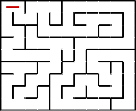
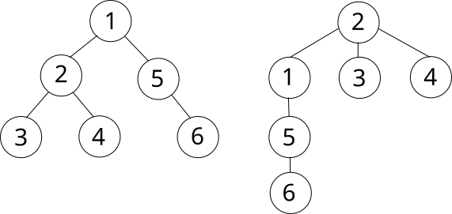
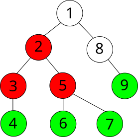

## Краткое введение в рекурсию

Возможно, вам уже когда-либо приходилось сталкиваться с рекурсией. Рекурсия -
фундаментальное понятие в информатике, в каком-то смысле настолько же
важное, как и циклы.

По определению, рекурсивная функция - функция, которая вызывает сама
себя. В математической терминологии рекурсивная функция *определяется*
через саму себя. Существует множество известных примеров рекурсивных функций,
приведём две самых известных:


- 
    Факториал. По определению, факториал от числа $$N$$ - произведение
    всех чисел от $$1$$ до $$N$$. Рекурсивно это записывается так:

    $$1! = 1 \\
    N! = (N - 1)! * N$$

    Первая формула - крайний случай, определяющий факториал от единицы.
    Вторая формула - общий случай, определяющий факториал от любого натурального
    числа через факториал от предыдущего числа.
    

- 
    Последовательность чисел Фибоначчи. По определению каждое число этой последовательности -
    сумма двух предыдущих. Два первых числа в разных источниках определяются по разному: это могут
    быть $$0$$ и $$1$$, или $$1$$ и $$1$$. Мы будем придерживаться второго варианта:

    $$F_1 = F_2 = 1 \\
    F_n = F_{n - 1} + F_{n - 2}$$

    И опять у нас две формулы: для крайнего случая и для общего.
    


В программировании это записывается так же прозрачно:


int fact(int x) {
    if (x == 1) {
        return 1;
    } else {
        return fact(x - 1) * x;
    }
}

int fib(int n) {
    if (n <= 2) {
        return 1;
    } else {
        return fib(n - 1) + fib(n - 2);
    }
}



(Примечание: хотя числа Фибоначчи - хороший пример рекурсии в математике,
в программировании приведённую выше рекурсивную реализацию ни в коем случае
нельзя использовать на практике. Её сложность равна порядка
$$O(2^n)$$, что, разумеется, неприемлемо. Более подробно это будет разобрано в лекции
про динамическое программирование.)

Существует мнение, что лучший способ понять рекурсию - это
[~~понять рекурсию~~](recursion_meme.jpg)
работа с целесообразными рекурсивными алгоритмами. Поэтому не будем
углубляться в детали, а сразу перейдём к поиску в глубину.

## Принцип работы обхода в глубину

Обход в глубину, или DFS (*англ.* depth-first search), в чём-то похож
на действия, выполняемые человеком для прохождения лабиринта (DFS собственно и
является алгоритмом для решения лабиринтов). Находясь на очередной развилке, мы
ставим метку, обозначающую, что мы уже здесь были, после чего идём в произвольном
ещё не посещённом направлении. На следующей развилке мы выполняем **те же**
действия, и так пока не попадём на развилку, которая не открывает нам ни одного нового
пути (все уже посещены). В таком случае мы возвращаемся на предыдущую развилку и, если
там ещё остались непосещённые направления, идём туда. Если же оттуда также некуда идти,
то мы возвращаемся назад ещё на одну развилку, и так далее, пока не найдём непосещённое
направление.

Иллюстрация прохождения лабиринта с помощью DFS:



Неочевидным моментом может быть выбор конкретного непосещённого направления
из нескольких возможных на очередной развилке. DFS никак этого не определяет.
Можно, например, всегда стараться идти вправо вниз, или наоборот, влево вверх,
или вообще выбирать случайное направление. На суть алгоритма это никак не
влияет. **DFS выбирает случайный путь, тогда как BFS ищет кратчайший.**

В принципе, точно описать алгоритм можно всего лишь одной функцией со следующим
псевдокодом:

```
dfs(v):
    visited[v] = true
    ...обработка вершины v
    for v -> u:
        if not visited[u]:
            dfs(u)
```

Иллюстрация обхода графа (дерева) с помощью DFS:


## Реализация для произвольного графа

Для представления графа используется список смежности:


#include <bits/stdc++.h>

using namespace std;

vector<int> graph[100000];
bool used[100000];      //вместо visited массив меток обычно называют used.

void dfs(int v) {
    used[v] = true;
    cout << "DFS at vertex " << v + 1 << endl;

    for (int u: graph[v]) {
        if (!used[u]) {
            dfs(u);
        }
    }
}

int main() {
    //Ввод графа...

    dfs(0);     //Начинаем обход с вершины 0.
}



Как видите, код получился очень лаконичным: функция DFS уложилась в 10 строк.

## Реализация для дерева

Очень часто DFS применяется не для произвольного графа, а для дерева.
Это позволяет реализовать алгоритм немного по другому: засчёт отсутствия
в дереве циклов мы можем избавиться от массива $$used$$. Достаточно всего лишь
передавать в функцию ещё один параметр: предыдущую вершину. Этот параметр
необходим, чтобы не попасть в бесконечный цикл из двух вершин (постоянно
проходя по одному и тому же ребру).

Реализация:


#include <bits/stdc++.h>

using namespace std;

vector<int> graph[100000];    //храним дерево как и обычный граф

void dfs(int v, int p = -1) {   //p (от parent) - предыдущая вершина, для начальной вершины равна -1.
    cout << "DFS at vertex " << v + 1 << endl;

    for (int u: graph[v]) {
        if (u != p) {
            dfs(u, v);
        }
    }
}

int main() {
    //Ввод графа...

    dfs(0);     //Начинаем обход с вершины 0.
}



С обходом деревьев связана некоторая дополнительная терминология. Вершину,
с которой начинается обход называют **корнем**. Иногда в задачах
корень дерева явно обозначен, а иногда его нужно выбирать самостоятельно (чаще
всего эту роль выполняет первая вершина). Начав обход дерева с другой вершины
(другого корня), мы получим другой порядок обхода вершин. Для обозначения такого
действия есть свой термин: **подвешивание** дерева за определённую
вершину.



Изображено одно и то же дерево, подвешенное за разные вершины: 1 и 2
соответственно. Чаще всего деревья изображаются в таком виде: корень сверху,
все остальные вершины вертикально разделены по уровням. Считается, что BFS
"спускается" по дереву сверху вниз.

Все вершины, в которые мы можем попасть из определённой вершины, спускаясь
"вниз" с помощью DFS, называются её **поддеревом**. Вершины, из
которых мы больше не можем никуда "спуститься" называются **листьями**.



На иллюстрации зелёным цветом закрашены листья дерева, а красным -
поддерево вершины 2 (листья тоже в него входят).

## Применение DFS

Главное преимущество DFS перед BFS - простота реализации. На это
влияет как малый размер необходимого кода, так и рекурсивный подход вместо
итеративного (со временем вы начнёте воспринимать рекурсию гораздо более
натурально, чем циклы и структуры данных). На реализацию DFS с опытом уходит
менее 10 секунд.

Что касается выполнимых задач, стоит чётко уяснить один факт: **DFS не может
находить кратчайшие пути**. Как бы вы не пытались его модифицировать, это
невозможно по определению. В остальном область применения DFS в основном совпадает
с таковой у BFS, и выбор одного из алгоритмов - личное дело каждого.

На практике DFS чаще всего используют для проверка графа на связность, или
более обобщённо, поиска компонент связности, поиска циклов и работы с деревьями.
