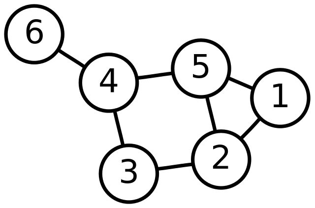
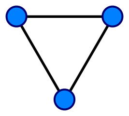
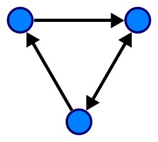
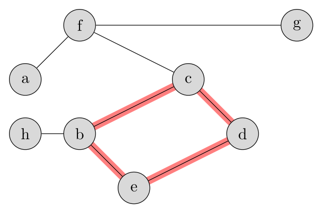
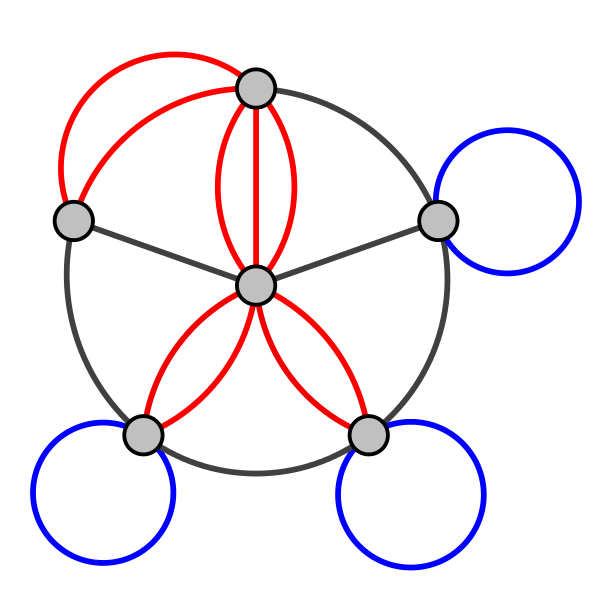

## Определение графа

Графы - фундаментальное понятие как в математике, так и в информатике.
Проще всего объяснить его с помощью аналогии с дорожной системой. Существует
определённый набор городов, некоторые из которых связаны дорогами, которые
могут быть как односторонними, так и двухсторонними. Вся эта структура и
называется графом.

Ну а более формально, граф - комбинация набора вершин и набора рёбер.
Вершины - это города, а рёбра - дороги. Визуально граф можно
представить так:

Этот граф состоит из 6 вершин, пронумерованных начиная с единицы, и 7
двухсторонних рёбер. Рёбра обычно записывают в виде пар вершин, которые они
соединяют: $$1$$-$$2$$, $$1$$-$$5$$, $$2$$-$$3$$, $$2$$-$$5$$, $$3$$-$$4$$, $$4$$-$$5$$, $$4$$-$$6$$.

## Ориентированные и неориентированные графы

Мы уже упоминали, что "дороги" в графе могут быть как односторонними, так
и двухсторонними. Для этого свойства существует отдельный термин: односторонние
"дороги" называются ориентированными рёбрами (или дугами), а двухсторонние -
неориентированными.

Граф, в котором все рёбра неориентированные, также называют неориентированным,
а граф с ориентированными рёбрами, соответственно, ориентированным.

|  |  |

Слева изображён неориентированный граф, а справа - ориентированный. Как
несложно догадаться, левый граф можно обходить как по часовой стрелке, так и
против, а правый можно полностью обойти только по часовой, хотя одно из ребёр в
нём также неориентированное (считается, что это два противоположных
ориентированных ребра).

## Пути и циклы

Путём в графе называется последовательность вершин, каждая из которых
соединена со следующей ребром. Чаще всего под "путём" подразумевают простой
путь, все вершины которого различны. Путь, который проходит через какую-либо
вершину более одного раза называют сложным путём.

Если первая вершина пути совпадает с последней, то такой путь называют
циклом.

Приведём примеры на этом графе:

Из множества возможных простых путей самый длинный: $$a - f - c - d - e - b - h$$
(существуют и другие пути с такой же длиной).

Циклом является путь $$b - c - d - e - b$$ (выделен цветом). Можно начать и
с любой другой вершины, например, $$c - d - e - b - c$$.

## Кратные рёбра и петли

Существует множество разновидностей графов, и среди них встречаются довольно
специфические. В частности, так называемые мультиграфы разрешают наличие между
двумя вершинами нескольких рёбер (называемых кратными рёбрами), а также
наличие петель. Петля - ребро, входящее в ту же вершину, из которой
исходит. Выглядят они следующим образом:

Красным выделены кратные рёбра, а синим - петли.

Мультиграфы встречаются в задачах реже чем обычные графы (называемые простыми),
но всё же встречаются, поэтому стоит иметь о них элементарное представление.

## Связные графы

Граф называется связным если между любой парой вершин существует хотя бы
один путь. Как пример рассмотрим следующий граф:

Одно из рёбер проведено штрихами. Если это ребро присутствует, то граф
является связным. Если же его убрать, то связность теряется, граф разбивается
на две части, друг с другом не связанные. Такие части называются компонентами
связности.

## Определение дерева

Дерево - вид графа, который можно назвать самым простым, но они
обладают множеством особых свойств и встречаются в задачах чуть ли не чаще
остальных графов.

**Дерево - это связный граф без циклов, петель и кратных рёбер.**

Все изображённые графы являются деревьями:

<!-- TODO this layout could be better -->

   
   

Среди множества свойств деревьев можно выделить два самых известных:

- Количество рёбер связано с количеством вершин формулой $$E = V - 1$$.
- Между любой парой вершин существует ровно один путь.

## Матрица смежности

Существует два основных способа представления графов в программировании.
Один из них, матрица смежности, используется гораздо реже, но очень просто
реализуется. Граф из $$N$$ вершин задаётся матрицей (двумерным массивом) $$N * N$$,
в которой $$g[i][j]$$ - логическое значение, <code>true</code> или
`false`, обозначающее, существует ли ребро из вершины $$i$$ в вершину
$$j$$.

В качестве примера решим простую задачу: для каждой вершины графа выведем
количество рёбер, смежных с ней.



using namespace std;

bool graph[1000][1000];

int main() {
    int n, m;       //количество вершин и рёбер соответственно
    cin >> n >> m;

    for (int i = 0; i < m; i++) {
        int u, v;   //номера вершин, соединённых очередным ребром
        cin >> u >> v;

        u--, v--;   //Здесь стоит остановиться и вдуматься.
                    //Чаще всего в задачах вершины будут нумероваться с 1 до N,
                    //в отличие от индексации массивов в C++.

                    //У этой проблемы есть два решения.
                    //Первое: работать с номерами "как есть": создавать массивы размером N + 1,
                    //использовать циклы от 1 до N, и т.д.
                    //Второе: уменьшать номера вершин на единицу при вводе, и увеличивать обратно при выводе

                    //Какое из них использовать - ваш личный выбор.
                    //Для меня 1-индексация в С++ выглядит очень чужеродно, поэтому я использую второе решение.

        graph[u][v] = graph[v][u] = true;   //Если бы граф был ориентированным, то обратное ребро мы бы не создавали.
    }

    for (int i = 0; i < n; i++) {
        int c = 0;
        for (int j = 0; j < n; j++) {
            if (graph[i][j]) {
                c++;
            }
        }

        cout << c << " edges adjacent to vertex " << i + 1 << endl;
    }
}


Преимущества матрицы смежности:

- Сложность проверки наличия ребра между двумя вершинами: $$O(1)$$

Недостатки матрицы смежности:

- Занимает $$N^2$$ памяти, что неприемлемо для достаточно больших графов.
- Сложность перебора всех вершин, смежных с данной: $$O(N)$$

## Список смежности

Гораздо чаще для представления графов используется список смежности. Его
идея заключается в хранении для каждой вершины расширяемого массива (вектора),
содержащего всех её соседей.

Решим ту же задачу с использованием списка смежности (и С++11 для for-each):



using namespace std;

vector<int> graph[100000];    //массив из 100000 векторов.

int main() {
    int n, m;
    cin >> n >> m;

    for (int i = 0; i < m; i++) {
        int u, v;
        cin >> u >> v;
        u--, v--;

        graph[u].push_back(v);
        graph[v].push_back(u);
    }

    for (int i = 0; i < n; i++) {
        int c = 0;
        for (int v: graph[i]) {     //можно было бы просто записать "int c = graph[i].size();",
            c++;                    //но такая реализация показывает, как можно перебирать
        }                           //соседние вершины.

        cout << c << " edges adjacent to vertex " << i + 1 << endl;
    }
}


Если требуется также удалять рёбра, то вместо вектора нужно использовать
`std::set`.

Преимущества списка смежности:

- Использует $$O(M)$$ памяти, что оптимально.
- Позволяет быстро перебирать соседей вершины.
- Позволяет за $$O(\log N)$$ проверять наличие ребра и удалять его (при использовании <code>std::set</code>).

Недостатки списка смежности:

- При работе с насыщенными графами (количество рёбер близко к $$N^2$$)
    скорости $$O(\log N)$$ может не хватать (единственный повод использовать матрицу смежности).
- Для взвешенных графов приходится хранить <code>vector<pair<int, int>></code>, что
    усложняет код.

