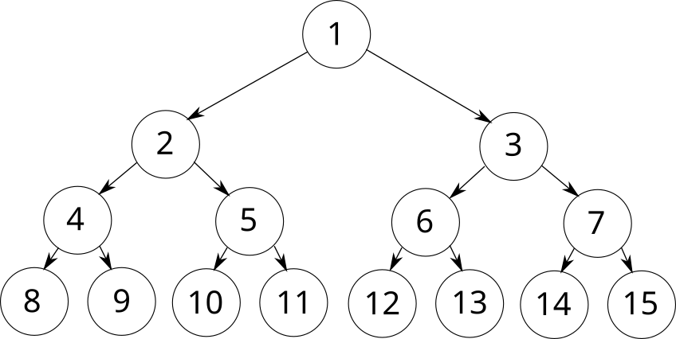
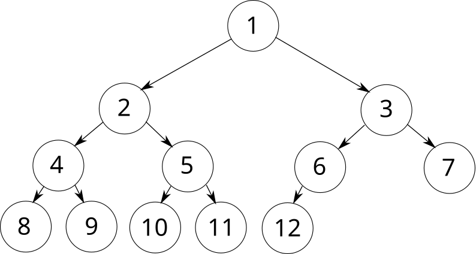
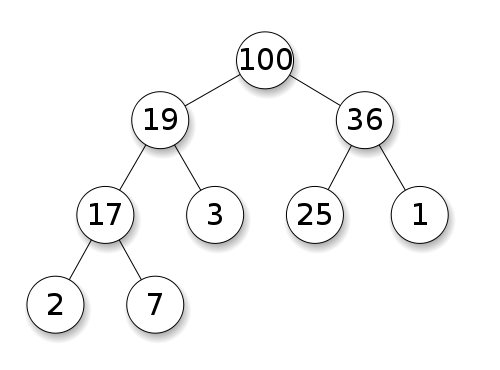

## Бинарное дерево

Среди деревьев выделяют особый подкласс, называемый бинарными деревьями.
Бинарное дерево - корневое дерево, каждая вершина которого имеет
не более двух дочерних, чаще всего чётко упорядоченных: левую и правую.
Например, это дерево является бинарным:


Среди бинарных деревьев отдельно выделяют **полные бинарные деревья**, все вершины которых имеют по две дочерних, кроме листьев, которые расположены на
одинаковой глубине:



Также полными часто называют бинарные деревья, у которых полностью заполнены все
уровни, кроме последнего:



При 1-индексации вершин по уровням, приведённой выше, существуют простые формулы
перехода между вершинами. Для вершины с индексом $$v$$ формулы для спуска влево,
спуска вправо, и подъёма вверх выглядят следующим образом:

$$l = 2v \\
r = 2v + 1 \\
p = \left\lfloor {v \over 2} \right\rfloor$$

В связи с этим полные бинарные деревья чаще всего хранят не в виде списка
смежности, а в виде простого массива, где $$tree[v]$$ - некоторое значение,
присвоенное вершине с индексом $$v$$. Для обхода дерева используются формулы,
приведённые выше.

Стоит отметить, что высота (количество уровней) полного бинарного дерева из
$$N$$ вершин равна $$\log N$$. Это свойство часто используется для оценки сложности
различных алгоритмов.

## Куча

Куча (*англ.* heap) - одна из простейших структур данных,
основанных на деревьях. Куча используется для поддерживания некоторого множества
элементов с возможностью быстрого нахождения максимума (или минимума, это не
принципиально).

Классическая куча поддерживает следующие операции:


- Добавить элемент (Сложность: $$O(\log N)$$)
- Найти максимум (Сложность: $$O(1)$$)
- Извлечь максимальный элемент (Сложность: $$O(\log N)$$)


Элементы в куче хранятся в виде полного бинарного дерева. Главное его
свойство (**инвариант** кучи) формулируется следующим образом:

> Элемент в каждой вершине больше либо равен элементов во всех дочерних вершинах.

Из этого свойства следует, что минимальный элемент всегда будет находиться
в корне дерева.



При добавлении в кучу нового элемента, ему присваивается первый доступный
индекс. То есть, бинарное дерево заполняется по уровням слева направо. После
добавления элемента возможно, что инвариант кучи перестанет выполняться, так
как новый элемент будет больше своего прямого предка. В таких случаях просто
меняем элемент местами с прямым предком. Если инвариант кучи всё ещё не
выполняется, меняем его местами с новым предком, и так далее, пока куча не
нормализуется. Такая операция называется **проталкиванием вверх**.

При извлечении максимального элемента воспользуемся следующей хитростью:
переместим последний элемент в куче (крайний правый на последнем уровне) в
корень дерева на место удалённого максимума. Это почти наверняка нарушит
инвариант, так как новый "максимум" будет меньше элементов в дочерних вершинах.
Сравним два дочерних элемента, выберем из них больший, и поменяем его местами
с текущим "максимумом". Повторяем эту операцию, пока инвариант не восстановится.
Это называется **проталкиванием вниз**.

## Реализация


struct heap {
    vector<int> tree;

    heap() {
        tree.push_back(0);  //Мы собираемся работать в 1-индексации, поэтому
                            //просто поместим в tree[0] произвольное значение.
    }

    void push(int x) {
        tree.push_back(x);
        sift_up(tree.size() - 1);
    }

    int max() {
        if (tree.size() > 1) {
            return tree[1];
        } else {
            //Ошибка: попытка найти максимум в пустой куче
        }
    }

    void pop() {
        if (tree.size() > 1) {
            tree[1] = tree.back();
            tree.pop_back();
            sift_down(1);
        } else {
            //Ошибка: попытка извлечь максимум из пустой кучи
        }
    }

    //Проталкивание вверх.
    void sift_up(int v) {
        if (v == 1) {
            return;     //Больше некуда подниматься.
        }

        if (tree[v / 2] < tree[v]) {
            swap(tree[v], tree[v / 2]);
            sift_up(v / 2);
        }
    }

    //Проталкивание вниз
    void sift_down(int v) {
        if (v * 2 >= tree.size()) {
            return;     //Больше некуда спускаться.
        }

        //Индекс большего дочернего элемента
        int max_idx;
        if (v * 2 + 1 == tree.size()) {     //Если можно спуститься только влево
            max_idx = v * 2;
        } else if (tree[v * 2] >= tree[v * 2 + 1]) {
            max_idx = v * 2;
        } else {
            max_idx = v * 2 + 1;
        }

        if (tree[v] < tree[max_idx]) {
            swap(tree[v], tree[max_idx]);
            sift_down(max_idx);
        }
    }

    bool empty() {
        return tree.size() == 1;
    }
};



## Понятие очереди с приоритетом

Вы можете услышать, как вместо термина "куча" используется термин **"очередь
с приоритетом"**. На практике они взаимозаменимы, хотя разница в значении
всё-таки присутствует.

Очередь с приоритетом - абстракная структура данных,
позволяющая поддерживать множество элементов, находить и извлекать минимум из
него, тогда как куча - конкретная структура данных, основанная на полном
бинарном дереве. Любая куча является очередью с приоритетом, но не любая очередь
с приоритетом (в теории) является кучей (на практике почти что любая). Вы можете
реализовать поддержку множества с извлечением максимума с помощью простого массива,
она будет иметь сложность операций $$O(N)$$, но всё равно являться очередью с
приоритетом.

*(Если вы знакомы с объектно-ориентированным программированием, то очередь с
приоритетом - интерфейс, а куча - класс, реализующий его.)*

## Очередь с приоритетом в стандартной библиотеке C++

В стандартной библиотеке C++ присутствует реализация кучи, поддерживающая
все операции, приведённые выше. Это класс `std::priority_queue<T>`.
Для работы с ним используются следующие методы:

```cpp
bool empty();
unsigned int size();
T top();            //"Верхний" элемент. По умолчанию - максимум.
void push(T x);     //Добавить элемент в очередь.
void pop();         //Извлечь элемент.
```

По умолчанию используется куча для поиска максимума. Для использования кучи
для поиска минимума нужно использовать тип `std::priority_queue<T, vector<T>, greater<T>>`.
